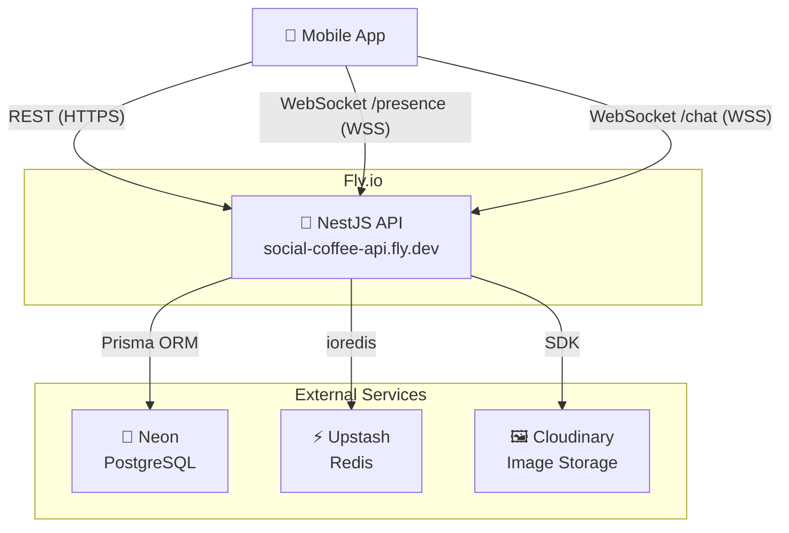
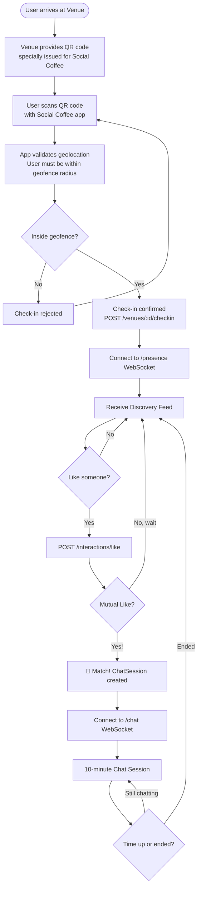
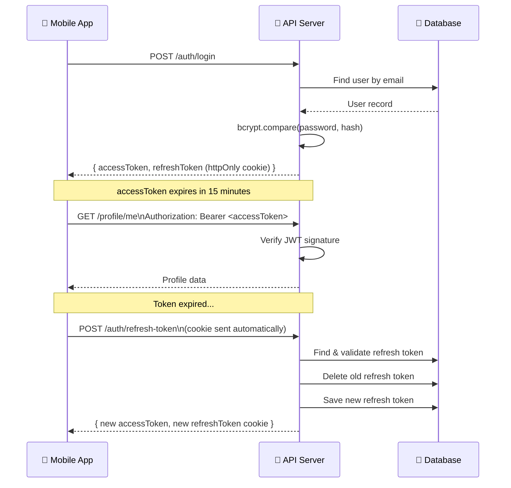
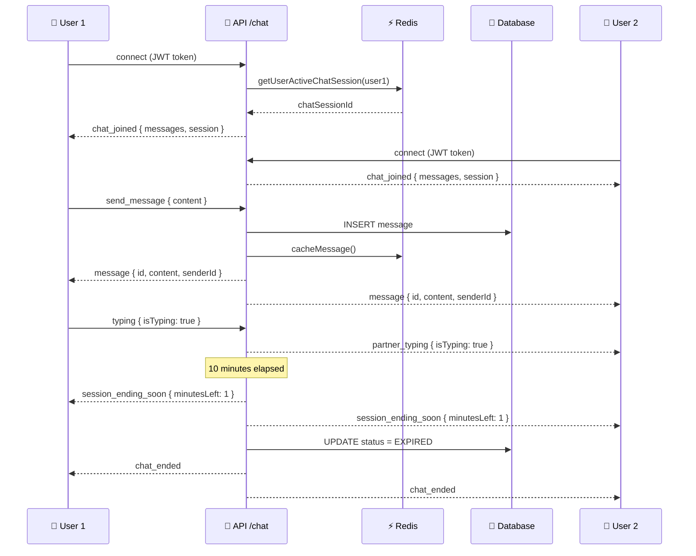
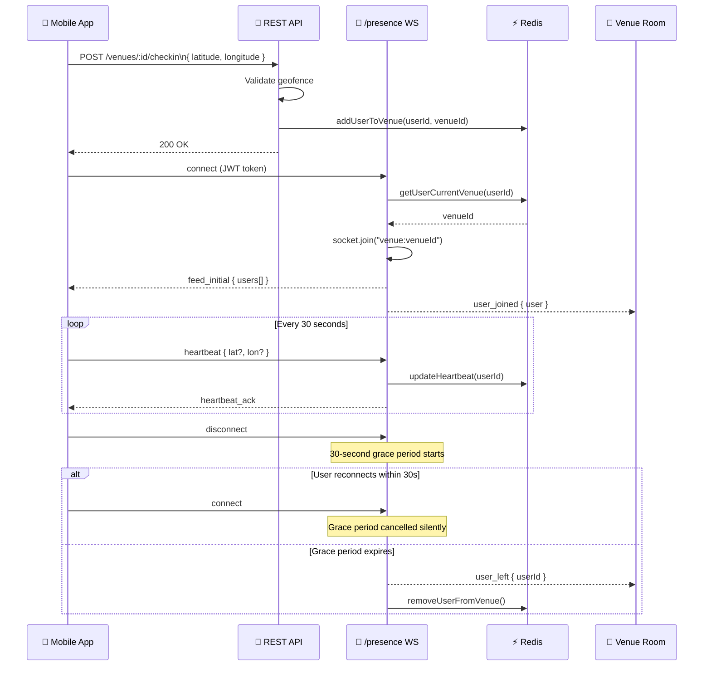

# Architecture Diagrams

## 1. System Architecture



---

## 2. Database Schema (ERD)

```mermaid
erDiagram
    User {
        uuid id PK
        string firstName
        string lastName
        date birthDate
        string email UK
        string passwordHash
        enum gender
        enum role
        string profileImageUrl
        string bio
        datetime deletedAt
    }

    Preference {
        cuid id PK
        uuid userId FK UK
        int minAge
        int maxAge
        enum preferredGender
        enum[] lookingFor
    }

    Interest {
        cuid id PK
        string name UK
    }

    UserInterest {
        uuid userId FK
        cuid interestId FK
    }

    Venue {
        cuid id PK
        string name
        string mapUrl
        float latitude
        float longitude
        int geofenceMeters
        enum status
    }

    Interaction {
        cuid id PK
        string venueId FK
        uuid actorUserId FK
        uuid targetUserId FK
        enum type
    }

    ChatSession {
        cuid id PK
        string venueId FK
        uuid user1Id FK
        uuid user2Id FK
        enum status
        datetime startedAt
        datetime expiresAt
    }

    Message {
        cuid id PK
        string chatSessionId FK
        uuid senderId FK
        string content
        datetime createdAt
    }

    Token {
        cuid id PK
        uuid userId FK
        string token UK
        enum type
        datetime expiresAt
    }

    User ||--o| Preference : "has"
    User ||--o{ UserInterest : "picks"
    Interest ||--o{ UserInterest : "picked by"
    User ||--o{ Interaction : "acts"
    User ||--o{ Interaction : "receives"
    Venue ||--o{ Interaction : "scoped to"
    Venue ||--o{ ChatSession : "hosts"
    User ||--o{ ChatSession : "user1"
    User ||--o{ ChatSession : "user2"
    ChatSession ||--o{ Message : "contains"
    User ||--o{ Message : "sends"
    User ||--o{ Token : "owns"
```

---

## 3. User Journey Flow



---

## 4. Authentication Flow



---

## 5. Real-time Chat Flow



---

## 6. Presence & Venue Flow


